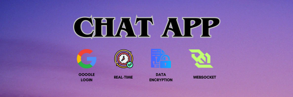
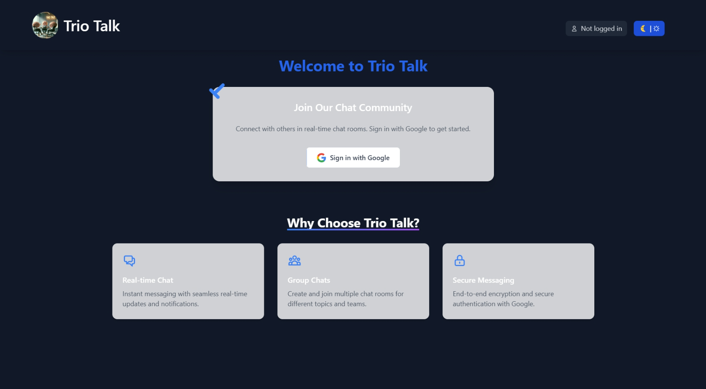
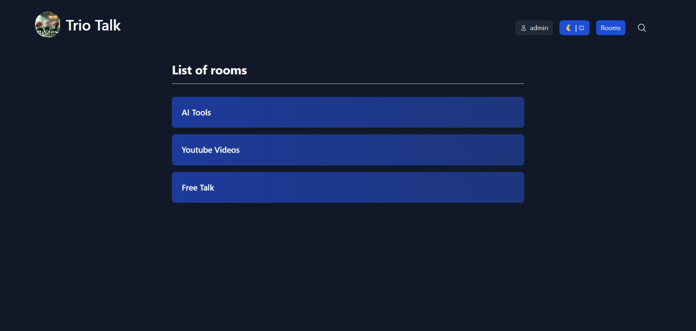
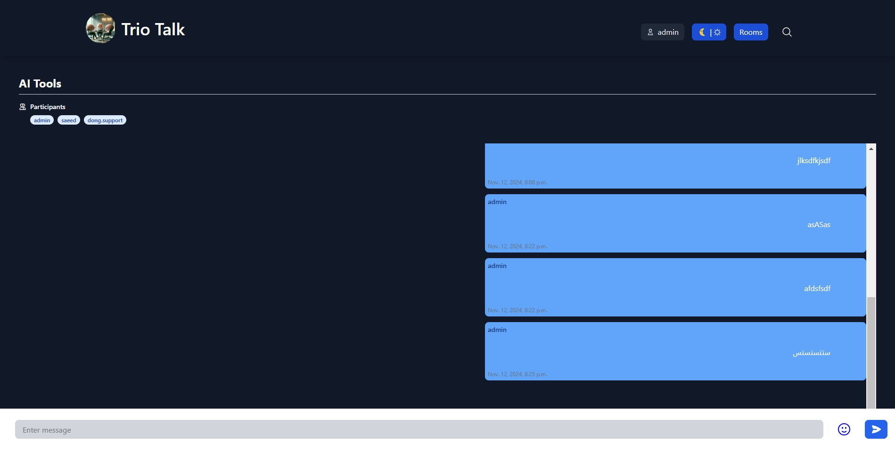
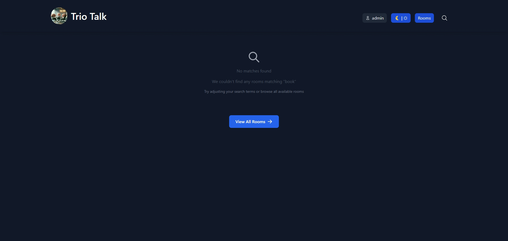
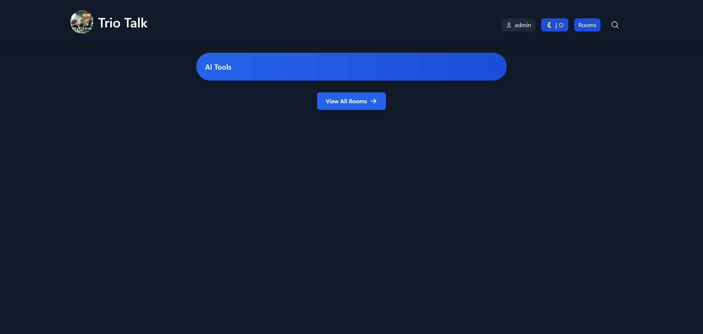
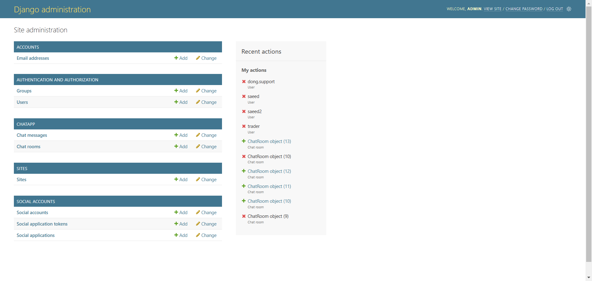

# Chat Application

        

A secure chat application built with Django, WebSockets, and end-to-end encryption.

## 🌟 Features
- Real-time messaging using WebSockets
- End-to-end encryption for all messages
- Google Authentication
- Dark/Light mode toggle
- Responsive design with Tailwind CSS
- Chatroom search functionality
- Auto-detecting text direction for multiple languages

## 📸 Screenshots
### welcome page
Users with who are not logged in will be redirected to the welcome page till they are logged in:

        

### Chat Rooms
Admin can create different chatrooms on the chatapp and all chatrooms are available like the image below:

        

### Active Chat
Users can chat in chatroom and participants will be show on the button of chatroom group name:

        

### Search option
Users can search for a specific chatroom with this feature:

        
        

### Admin page

        

## 🚀 Getting Started

